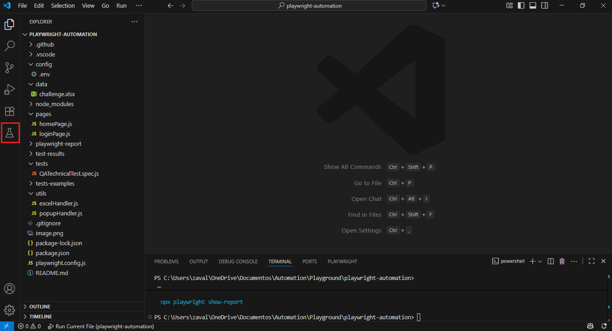
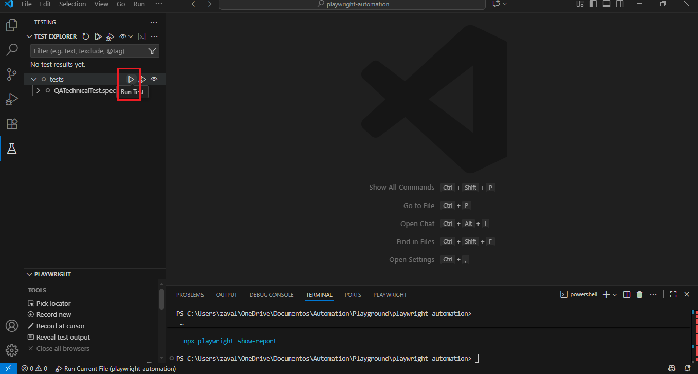

# AUTOMATION CHALLENGE

The objective is to automate the process of inputting data from an Excel file into a web form, where the form fields change dynamically after each submission. The script must handle dynamic changes, log in to the website, and complete the task with 100% accuracy within a specified time frame.

## PROJECT REQUIREMENTS
1. Automate the Workflow:
    -Framework: Use Playwright in Javascript.
    -Design Pattern: You can use any design pattern of your choice
    -The script must read data from an Excel file and input the data into the corresponding fields on the web page: https://www.theautomationchallenge.com/.
    -The fields on the web page will change their location, size, selector, and label position every time the "Submit" button is clicked. Your script must dynamically identify and input the correct data into the correct fields for all 50 rows in the Excel file.

2. Handle reCAPTCHA:
    -The web page may display a random reCAPTCHA pop-up. The script should be able to handle this to continue the test without a problem.

3. Login:
    -The script must log in before starting the automation.

4. Performance:
    -The script must complete the task with 100% accuracy.
    -The script must finish in less than 4 minutes.

## PRE-REQUISITES AND DEPENDENCIES 📋
PRE-REQUISITES:
1. Download NodeJS v24.5.2 : https://nodejs.org/es/download
2. Download VS Code: https://code.visualstudio.com/download
3. Download Playwright v1.55.1 (latest version):
    - Open https://playwright.dev/docs/getting-started-vscode and follow the "Getting Started - Installation & Setup" process to install Playwright.

DEPENDENCIES:
1. Install dotenv:
    - In VS Code terminal, run the following command: npm install dotenv --save
2. Install xlsx:
    - In VS Code terminal, run the following command:  npm install xlsx

## ASSUMPTIONS

1. OS: Windows
2. Google Chrome explorer installed.
3. Windows scripts execution from VS Code Terminal enabled.
4. Git installed

## GETTING STARTED

1. Download GitHub Desktop: https://desktop.github.com/download/
2. Open GitHub Desktop and click on "File/Clone repository
3. Select "URL" and paste: " https://github.com/angelzr4/automationChallenge.git"
4. Choose your local path in which you want to clone the GitHub repository.
5. Click on "Clone". Repository should be clone succesfully into your specified local path.
6. Open VS Code. click on "File/Open Folder and select your local clone directory.

## EXECUTE TEST

To run the test:
    1. Click on "Testing" icon in the left VS Code bar window: 
    2. Click on "Run Test" icon next to "tests": 
    3. Wait for the execution to be completed.

### ANALIZE TEST REPORT

1. Reports are stored in "playwright-report" project folder.
2. Open using your explorer and analize test results.

## AUTHOR

* **Ángel Zavala Rebollo** - (https://github.com/angelzr4)
